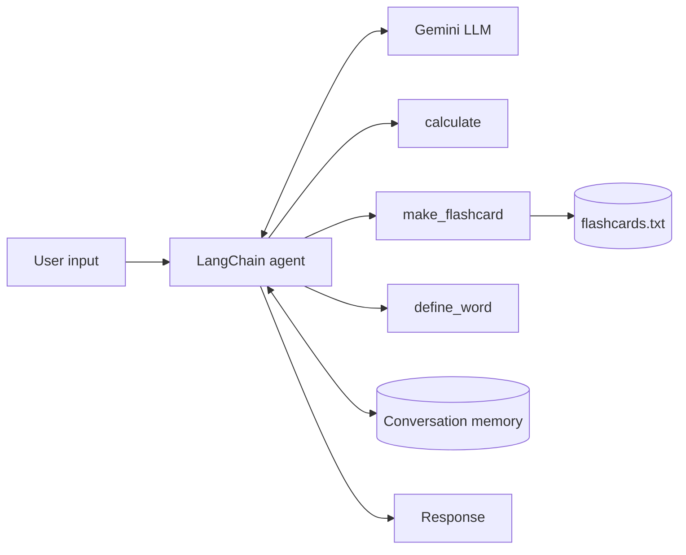

# Study Buddy

An AI study assistant that runs in the terminal. Study Buddy explains concepts, quizzes the user, solves math problems, defines vocabulary, and generates flashcards that are saved to a file, while keeping track of the conversation so follow-up questions work naturally.

Built with **Python**, **LangChain 1.x**, **LangGraph**, and the **Google Gemini API**.

## Features

- **Tool-using AI agent.** The language model decides for itself when to call Python functions, choosing from three tools:
  - `calculate` evaluates math expressions
  - `make_flashcard` creates a flashcard and appends it to `flashcards.txt`
  - `define_word` returns a dictionary-style entry for a vocabulary term
- **Conversation memory.** Context carries across turns ("make a flashcard on my topic" knows what the topic is), and separate conversation threads stay isolated from each other.
- **Configurable personality.** The assistant can act as a friendly tutor, a pirate, or a strict professor, set by a single variable.
- **Provider-agnostic design.** The model is defined in one place (`config.py`), so the app can switch between Gemini, Claude, or GPT without code changes elsewhere.
- **Secure configuration.** API keys are loaded from environment variables and excluded from version control.

## Demo

<!-- Replace with a screenshot of the app running -->

```text
Study Buddy (friendly mode) is ready! Type 'quit' to exit.
Flashcards are saved to flashcards.txt

You: I'm studying the French Revolution. Make a flashcard for "Estates-General".
Buddy: Here's your flashcard, and it's been saved to flashcards.txt.
FRONT: Estates-General
BACK: France's assembly of the three estates (clergy, nobility, commoners),
      whose 1789 meeting helped spark the French Revolution.

You: What's 17.5% of 380?
Buddy: 17.5% of 380 is 66.5.

You: What topic am I studying again?
Buddy: You're studying the French Revolution!
```

## How It Works



At the core is a LangChain agent created with `create_agent`. Each Python function is registered as a tool, and its docstring and type hints tell the model what the tool does and what arguments it takes. When a message comes in, the agent runs a reasoning loop: the model decides whether a tool is needed, the tool runs, its result is fed back to the model, and the loop continues until the model produces a final answer.

Conversation memory is handled by a LangGraph checkpointer (`InMemorySaver`), which stores message history keyed by a thread ID. This lets the assistant resolve references to earlier messages while keeping different sessions separate.

## Project Structure

The project is organized as a progression, with each file introducing one core concept of LLM application development and the last file combining them into the finished app.

| File | Description |
|---|---|
| `step5_chat_app.py` | **Main application:** interactive chat with tools, memory, personas, and file output |
| `step1_basic_call.py` | Minimal model call through LangChain's provider-agnostic interface |
| `step2_prompt_chain.py` | Reusable prompt templates composed into a chain (`prompt \| model \| parser`) |
| `step3_agent_tools.py` | Tool-calling agent that prints each step of its reasoning loop |
| `step4_memory.py` | Demonstration of conversation memory and thread isolation |
| `config.py` | Model and provider selection |

## Tech Stack

| Area | Tools |
|---|---|
| Language | Python 3.10+ |
| LLM framework | LangChain 1.x, LangGraph |
| Model | Google Gemini (swappable for Claude or GPT) |
| Configuration | python-dotenv |

## Running Locally

Requires Python 3.10+ and a free API key from [Google AI Studio](https://aistudio.google.com/apikey).

```bash
git clone https://github.com/YOUR-USERNAME/study-buddy.git && cd study-buddy
python3 -m venv .venv && source .venv/bin/activate
pip install -r requirements.txt
cp .env.example .env   # add your GOOGLE_API_KEY
python3 step5_chat_app.py
```

## Future Improvements

- Retrieval-augmented generation (RAG) to answer questions from the user's own notes and PDFs
- A web interface using Streamlit
- Persistent memory backed by SQLite
- A safe math parser in place of Python's `eval`

## License

MIT. See [LICENSE](LICENSE).
